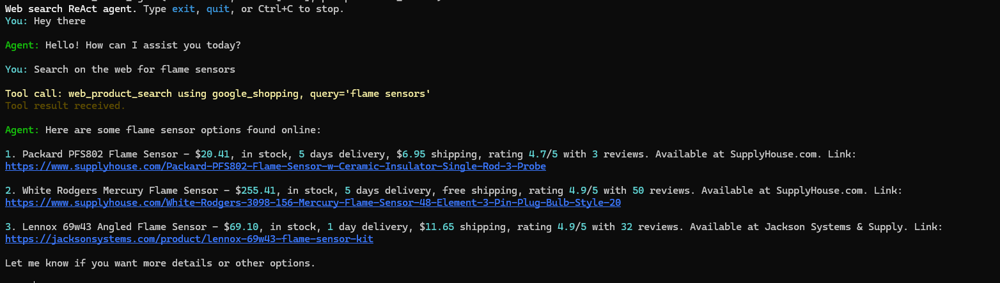

# Web Search Tool

Reusable web search module for product lookup and agent tool use.

## Setup

Create a `.env` file in this folder. Values in this file take precedence over
existing system environment variables when the REPL starts.

Required for Google Shopping:

```env
SERPAPI_API_KEY=...
OPENAI_API_KEY=...
```

Optional:

```env
ZYTE_API_KEY=...
TAVILY_API_KEY=...
WEB_SEARCH_SITES=supplyhouse.com
WEB_SEARCH_DEFAULT_METHOD=google_shopping
WEB_SEARCH_LLM_EXTRACTION_MODEL=gpt-4.1-mini
OPENAI_CHAT_MODEL=gpt-4.1-mini
```

## Run

```powershell
uv run python main.py
```

Then ask for product searches, for example:

```text
Find pricing for Littelfuse FLQ01-5 fuse on SupplyHouse.
```

## Screenshot



## Tests

Run all tests:

```powershell
uv run pytest -v -s
```

The test suite includes a real SerpAPI Google Shopping search for
`thermostat honeywell`. It requires `SERPAPI_API_KEY` in this folder's `.env`
or in the environment.
